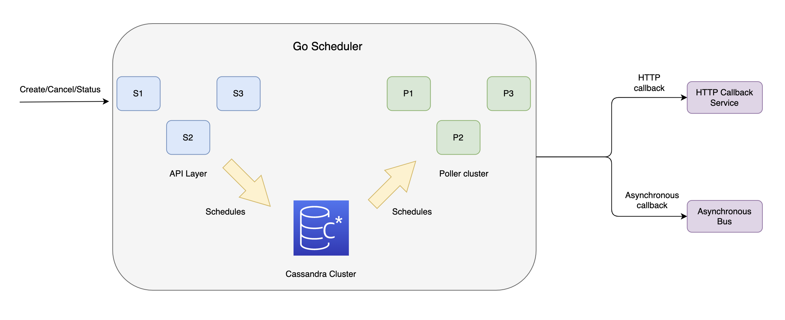

# Table of Contents
1. [GoScheduler](#goscheduler)
2. [Architecture](#architecture)
3. [Design Overview](#design-overview)
    - [Tech Stack](#tech-stack)
    - [Service Layer](#service-layer)
    - [Datastore](#datastore)
      - [Cassandra Data Model](#cassandra-data-model)   
    - [Poller Cluster](#poller-cluster)
      - [Poller Distribution](#poller-distribution)
      - [Scalability and Fault Tolerance](#scalability-and-fault-tolerance)
4. [How does it work?](#how-does-it-work) 
5. [Getting Started](#getting-started)
    - [Installation](#installation)
      - [Approach 1: Using Docker](#approach-1-using-docker)
      - [Approach 2: Manual Setup](#approach-2-manual-setup)
    - [Configuration](#configuration)
    - [Usage](#usage)
      - [Client onboarding](#client-onboarding)
      - [Schedule creation](#schedule-creation)
        - [Create one-time schedule](#create-one-time-schedule)
        - [Create cron schedule](#create-cron-schedule)
      - [Check Schedule Status](#check-schedule-status)
 
# GoScheduler
GoScheduler, also known as Myntra's Scheduler Service (MySS), is an open-source project designed to handle high throughput with low latency for scheduled job executions. GoScheduler is based on [Uber Ringpop](https://github.com/uber/ringpop-go) and offers capabilities such as multi-tenancy, per-minute granularity, horizontal scalability, fault tolerance, and other essential features. GoScheduler is written in Golang and utilizes Cassandra DB, allowing it to handle high levels of concurrent create/delete and callback throughputs. Further information about GoScheduler can be found in this [article](https://medium.com/myntra-engineering/myntra-scheduler-service-a0153a04526c).

# Architecture



# Design Overview
The Go Scheduler service consists of three major components - http service layer, poller cluster and datastore.

## Tech Stack
1. **Golang**: The service layer and poller layer of the Go Scheduler service are implemented using the Go programming language (Golang). Golang offers high throughput, low latency, and concurrency capabilities through its lightweight goroutines. It is well-suited for services that require efficient memory utilization and high concurrency.

2. **Cassandra**: Cassandra is chosen as the datastore for the Go Scheduler service. It provides horizontal scalability, fault tolerance, and distributed data storage. Cassandra is widely used within Myntra and is known for its ability to handle high write throughput scenarios.

## Service Layer
The service layer in the Scheduler service handles all REST traffic. It provides a web interface and exposes various endpoints for interacting with the service. Some of the important endpoints include:

- Register Client: This endpoint allows administrators to register a new client. A client represents a tenant, which is another service running its use case on the Go Scheduler service. Each client is registered with a unique ID.
- Schedule Endpoints: The service layer includes endpoints for creating schedules, cancelling schedules, checking status of the schedules, reconciling schedules etc. These endpoints are accessible only to registered clients.

## Datastore
The Scheduler service utilizes Cassandra as the datastore. It stores the following types of data:

- Schedule State Data: This includes the payload, callback details, and success/failure status after the trigger.
- Client Configuration Metadata: The datastore holds metadata related to client configurations.
- Poller Instance Statuses and Poller Node Membership: The status and membership information of poller instances are stored in the datastore.

### Cassandra Data Model
The data layout in Cassandra is designed in a way that during every minute, the poller instance request goes to a single Cassandra shard, ensuring fast reads.
The schedule table has the following primary key structure: (clientid, poller count id, schedule minute).

For example, the data for the use case mentioned earlier will look like:

```
C1, 1, 5:00PM, uuid1, payload
C1, 2, 5:00PM, uuid2, payload
...
C1, 50, 5:00PM, uuid50000, payload
```
Here, `uuid1` to `uuid50000` are unique schedule IDs.

In this data model, we perform 50,000 Cassandra writes and 50 Cassandra reads for the given use case.

It's important to note that not every schedule fire requires a read operation. The number of Cassandra reads in a minute is equal to the number of poller instances running for all clients. As Cassandra is well-suited for high write throughput and lower read throughput, this data modeling and poller design work effectively with the Cassandra datastore layer.

## Poller Cluster
The Poller Cluster in the Scheduler service utilizes the [Uber ringpop-go library](https://github.com/uber/ringpop-go) for its implementation. Ringpop provides application-level sharding, creating a consistent hash ring of available Poller Cluster nodes. The ring ensures that keys are distributed across the ring, with specific parts of the ring owned by individual Poller Cluster nodes.

### Poller Distribution
Every client within the Scheduler service owns a fixed number of Poller instances. Let's consider the total number of Poller instances assigned to all clients across all nodes as X. If there are Y clients where each client owns C1x, C2x, ..., CYx Poller instances respectively (where C1x + C2x + ... + CYx = X), and there are N Poller Cluster nodes, then each node would run approximately X/N Poller instances (i.e., X/N = C1x/N + C2x/N + ... + CYx/N).

### Scalability and Fault Tolerance
The Poller Cluster exhibits scalability and fault tolerance characteristics. When a node goes down, X/N Poller instances automatically shift to the available N-1 nodes, maintaining the distribution across the remaining nodes. Similarly, when a new node is added to the cluster, X/(N+1) Poller instances are shifted to the new node, while each existing node gives away X/N - X/(N+1) Poller instances.

This approach ensures load balancing and fault tolerance within the Poller Cluster, enabling efficient task execution and distribution across the available nodes.

# How does it work?
The GoScheduler follows a specific workflow to handle client registrations and schedule executions:

- **Client Registration:** Clients register with a unique client ID and specify their desired poller instance quota. The poller instance quota is determined based on the client's callback throughput requirements.
- **Poller Instances:** Each poller instance fires every minute and is responsible for fetching schedules from the datastore. Each poller instance can fetch a maximum of 1000 schedules, with each schedule having a maximum payload size of 1KB.
Assigning Poller Instances: When a client registers, they are assigned a specific number of poller instances. For example, if a client requires a callback requirement of 50000 RPM, they might be assigned 50 (50+x, where x is a buffer for safety) poller instances. These poller instances are identified by the client ID followed by a numeric identifier (e.g., C1.1, C1.2, ..., C1.50).
- **Scheduling and Distribution:** When a client creates a schedule, it is tied to one of the assigned poller instances using a random function that ensures a uniform distribution across all poller instance IDs. For example, if 50000 schedules are created with a fire time of 5:00 PM, each poller instance for this client will be assigned approximately 1000 schedules to be triggered at 5:00 PM. The schedules tied to each poller instance are fetched and triggered at the respective callback channels.
- **Scaling:** The GoScheduler can be horizontally scaled based on the increasing throughput requirements. For higher create/delete peak RPM, additional service nodes or datastore nodes (or both) can be added. Similarly, for higher peak callback RPM, the number of poller instances for a client can be increased, which may require adding new nodes in the poller cluster or datastore (or both). This scalability ensures that the service can handle increasing throughput by augmenting nodes in the service layer, poller cluster, and datastore.


# Getting Started

## Installation

### Approach 1: Using Docker

1. Install [Docker](https://docs.docker.com/get-docker/) on your machine.
2. Clone the repository. 
2. Change the current directory to the repository directory: `cd ./goscheduler`.
3. Build and run the Docker containers using the following command: 
```shell
docker-compose --no-cache build
docker-compose up -d
```
This starts the service instances on ports 8080 and 8081, respectively, and the Ringpop instances on ports 9091 and 9092.

### Approach 2: Manual Setup

1. Install [Go](https://go.dev/dl/) (>= 1.17)
2. Install [Cassandra](https://cassandra.apache.org/_/download.html) (>= 3.0.0) on your machine.
3. Set the environment variables:
  - `GOROOT`: Set it to the directory path of the Go SDK.
  - `GOPATH`: Set it to the path of the directory where you want to store your Go workspace.
These environment variables are required for the Go toolchain to work correctly and to manage Go packages.
3. Run the following command in the repository directory to download and manage the project's dependencies:
```
go mod tidy
```
4. Build the service by running the following command in the repository directory:
```
go build .
```
5. Start multiple instances of service using following commands:
```shell
PORT=8080 ./myss -h 127.0.0.1 -p 9091
PORT=8081 ./myss -h 127.0.0.1 -p 9092
```
This starts the service instances on ports 8080 and 8081, respectively, and the Ringpop instances on ports 9091 and 9092.

## Configuration

To configure the service, you can use the following options:

- `PORT`: Specify the port number for the service to listen on. For example, `PORT=8080`.

- `-h`: Set the hostname or IP address for the service. For example, `-h 127.0.0.1`.

- `-p`: Specify the port number(s) for the Ringpop instances. For example, `-p 9091` or `-p 9091,9092`.

- `-conf`: Provide the absolute path of a custom configuration file for the service. For example, `-conf /path/to/myconfig.yaml`.

- `-r`: Specify the port number where Ringpop is run for rate-limiting purposes. For example, `-r 2479`.

## Usage

### Client onboarding
Use the following API to create an app:

```bash
curl --location 'http://localhost:8080/myss/app' \
--header 'Content-Type: application/json' \
--data '{
    "appId": "test",
    "partitions": 5,
    "active": true
}'
```

Request Body
The request body should be a JSON object with the following fields:
- `appId (string)`: The ID of the app to create.
- `partitions (integer)`: The number of partitions for the app.
- `active (boolean)`: Specifies if the app is active or not.

Response
The API will respond with the created app's details in JSON format.

```json
{
    "status": {
        "statusCode": 201,
        "statusMessage": "Success",
        "statusType": "Success",
        "totalCount": 1
    },
    "data": {
        "appId": "test",
        "partitions": 5,
        "active": true,
        "configuration": {}
    }
}
```

### Schedule creation
#### Create one time schedule
```bash
curl --location 'http://localhost:8080/myss/schedule' \
--header 'Content-Type: application/json' \
--data '{
    "appId": "test",
    "payload": "{}",
    "scheduleTime": 1686676947,
    "callback": {
        "type": "http",
        "details": {
            "url": "http://127.0.0.1:8080/myss/healthcheck",
            "method": "GET",
            "headers": {
                "Content-Type": "application/json",
                "Accept": "application/json"
            }
        }
    }
}'
```

The request body should be a JSON object with the following fields:

- `appId (string)`: The ID of the app for which the schedule is created.
- `payload (string)`: The payload or data associated with the schedule. It can be an empty string or any valid JSON data.
- `scheduleTime (integer)`: The timestamp representing the schedule time.
- `callback (object)`: The callback configuration for the schedule.
  - `type (string)`: The type of callback. In this example, it is set to "http".
  - `details (object)`: The details specific to the callback type. For the "http" callback, it includes the URL, HTTP method, and headers.


The API will respond with the created schedule's details in JSON format.

Example response body:
```json
{
    "status": {
        "statusCode": 201,
        "statusMessage": "Success",
        "statusType": "Success",
        "totalCount": 1
    },
    "data": {
        "scheduleId": "2358e5b6-09f3-11ee-a704-acde48001122",
        "appId": "test",
        "payload": "{}",
        "scheduleTime": 1686676947,
        "callback": {
            "type": "http",
            "details": {
                "url": "http://127.0.0.1:8080/myss/healthcheck",
                "method": "GET",
                "headers": {
                    "Content-Type": "application/json",
                    "Accept": "application/json"
                }
            }
        }
    }
}
```
#### Create cron schedule
```bash
curl --location 'http://localhost:8080/myss/schedule' \
--header 'Content-Type: application/json' \
--data '{
    "appId": "test",
    "payload": "{}",
    "cronExpression": "*/5 * * * *",
    "callback": {
        "type": "http",
        "details": {
            "url": "http://127.0.0.1:8080/myss/healthcheck",
            "method": "GET",
            "headers": {
                "Content-Type": "application/json",
                "Accept": "application/json"
            }
        }
    }
}'
```

The request body should be a JSON object with the following fields:

- `appId (string)`: The ID of the app for which the cron schedule is created.
- `payload (string)`: The payload or data associated with the cron schedule. It can be an empty string or any valid JSON data.
- `cronExpression (string)`: The cron expression representing the schedule pattern.
- `callback (object)`: The callback configuration for the schedule.
  - `type (string)`: The type of callback. In this example, it is set to "http".
  - `details (object)`: The details specific to the callback type. For the "http" callback, it includes the URL, HTTP method, and headers.

**Supported Cron Expression**

Go Scheduler supports standard UNIX cron expression of the following pattern.
```
* * * * *
| | | | |
| | | | └─ Day of the week (0 - 6, where 0 represents Sunday)
| | | └── Month (1 - 12)
| | └──── Day of the month (1 - 31)
| └────── Hour (0 - 23)
└──────── Minute (0 - 59)
```

The Cron Expression consists of five fields, each separated by a space:

| Field         | Required | Allowed Values         | Symbols     |
|---------------|----------|------------------------|-------------|
| Minutes       | Yes      | 0-59                   | * ,/-       |
| Hours         | Yes      | 0-23                   | * ,/-       |
| Day of month  | Yes      | 1-31                   | * ,/-       |
| Month         | Yes      | 1-12 or JAN-DEC        | * ,-        |
| Day of week   | Yes      | 0-6 or SUN-SAT         | * ,-        |

The supported symbols and their meanings are as follows:

- `*`: Matches all possible values.
- `,`: Specifies multiple values.
- `/`: Specifies stepping values.
- `-`: Specifies a range of values.

Examples
- `0 0 * * *`: Executes a task at midnight every day.
- `0 12 * * MON-FRI`: Executes a task at 12 PM (noon) from Monday to Friday.
- `*/15 * * * *`: Executes a task every 15 minutes.
- `0 8,12,18 * * *`: Executes a task at 8 AM, 12 PM (noon), and 6 PM every day.

The API will respond with the created cron schedule's details in JSON format.

Example response body:
```json
{
    "status": {
        "statusCode": 201,
        "statusMessage": "Success",
        "statusType": "Success",
        "totalCount": 1
    },
    "data": {
        "schedule": {
            "scheduleId": "35b5e19e-0aa4-11ee-8563-acde48001122",
            "payload": "{}",
            "appId": "test",
            "partitionId": 3,
            "callback": {
                "type": "http",
                "details": {
                    "url": "http://127.0.0.1:8080/myss/healthcheck",
                    "method": "GET",
                    "headers": {
                        "Content-Type": "application/json",
                        "Accept": "application/json"
                    }
                }
            },
            "cronExpression": "*/5 * * * *",
            "status": "SCHEDULED"
        }
    }
}
```

### Check Schedule Status
```
curl --location 'http://localhost:8080/myss/schedule/a675115c-0a0e-11ee-bebb-acde48001122' \
--header 'Accept: application/json'
```

`{scheduleId}` is the actual UUID of the schedule you want to retrieve.

Example response body:
```json
{
    "status": {
        "statusCode": 200,
        "statusMessage": "Success",
        "statusType": "Success",
        "totalCount": 1
    },
    "data": {
        "schedule": {
            "scheduleId": "a675115c-0a0e-11ee-bebb-acde48001122",
            "payload": "{}",
            "appId": "test",
            "scheduleTime": 1686676947,
            "partitionId": 4,
            "scheduleGroup": 1686676920,
            "callback": {
                "type": "http",
                "details": {
                    "url": "http://127.0.0.1:8080/myss/healthcheck",
                    "method": "GET",
                    "headers": {
                        "Accept": "application/json",
                        "Content-Type": "application/json"
                    }
                }
            },
            "status": "SUCCESS"
        }
    }
}
```
Please find all the APIs under API documentation section
